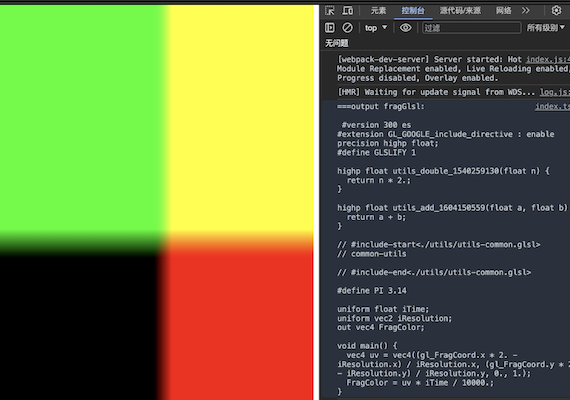

## usage

1. `npm i` or `yarn`

2. `npm run dev` or `yarn dev`

## config about [`glsl-module-loader`](https://github.com/z-juln/glsl-module-loader)

look config: [webpack.config.js](./webpack.config.js)

look output: 
